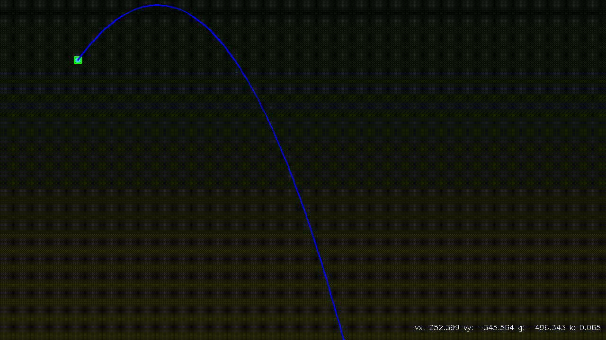
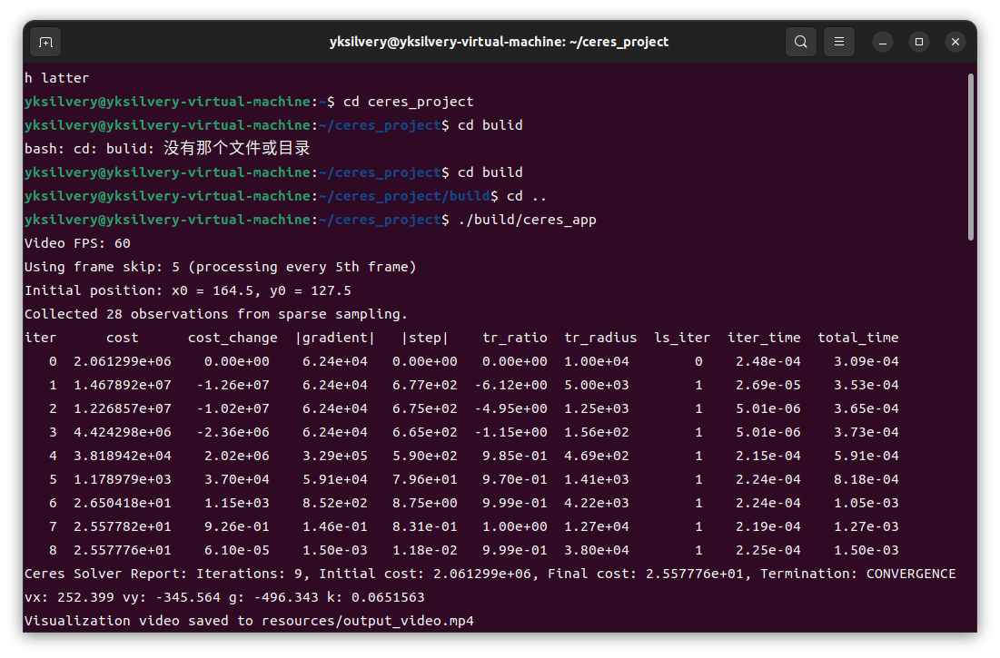

# XJTU-RMV-Task03

## 效果图





## 方法

- **球检测**：HSV颜色空间掩码和轮廓查找在视频帧中检测球体
- **拟合**：Ceres 拟合四参数（vx, vy, g, k）稀疏采样视频帧（因为更快XD）
- 好的可以不要把可视化的时间计算进去吗谢谢qwq

## 依赖项

- Ceres Solver 2.0.0
- OpenCV 4.5.4
- Eigen, SuiteSparse, LAPACK, BLAS
- ffmpeg（用于GIF转换）

## 构建和运行

```bash
mkdir build
cd build
cmake ..
make
cd ..
./build/opencv_app
```
